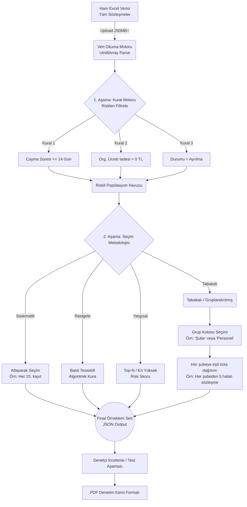

# Tasarruf Finansmanı – Gelişmiş Örneklem Metodolojisi

Mevcut sistemde, **sektörel risk odaklı** (örneğin; Organizasyon Ücreti İade İhlalleri, Tahsisat Gecikmeleri) örneklem üretmek için 3 aşamalı bir "Huni (Funnel)" mantığı kurgulanmıştır.

Sistemin en büyük avantajı; milyonlarca satırlık ham veriyi önce sektörel "Kırmızı Bayrak (Red Flag)" kurallarıyla filtrelemesi, *ardından* kalan riskli havuz içinden matematigine uygun (Tabakalı, Sistematik vb.) çekim yapmasıdır. 

## 1. Çalışma Akışı (Flowchart)

Aşağıdaki süreç şeması, verinin sisteme girişinden "PDF Raporu" oluşturulmasına kadar geçen algoritmayı detaylandırır:

## 2. "Şubedeki Personel Bazlı Çekilişli Seçim" Nasıl Kurgulanır?

Kullanıcının *"Tüm şubeler içerisinden (şube kolonunu ayrıştırarak), çekilişli teslimat tabisine uğrayanlara göre nasıl örneklem oluştururum?"* sorusunun cevabı şöyledir:

**Adım Adım Gelişmiş Kurgu:**

1. **Excel Yükleme:** İşletim sisteminden indirilen tüm aktif/pasif sözleşmeler (Ana Popülasyon) yüklenir.
2. **Filtreleme Aşaması (Popülasyonu Daraltma):**
   - Kural 1 Ekle: Kolon `Sözleşme Tipi` -> Şart `Eittir` -> Değer `Çekilişli`
   - Kural 2 Ekle: Kolon `Tahsisat Durumu` -> Şart `Eşittir` -> Değer `Gecikmeli` veya `Yapıldı` *(İsteğe bağlı)*
   *(Bu saniyede binlerce kişilik liste sadece **"Çekilişli Sözleşmesi Olanlara"** düşer)*
3. **Örneklem Adedi ve Metot Aşaması:**
   - Örneklem Büyüklüğü: `100` (100 dosya incelemek istiyorsunuz)
   - Seçim Metodolojisi: `Tabakalı (Gruplandırılmış)`
4. **Tabaka (Grup) Seçimi:**
   - *Hangi kolona göre tabakalanacak?* -> `Şube Adı` (veya `Personel Adı`) seçilir.

**Arka Planda (Node.js) Olan Matematik:**
Sistem arka planda (sampling.service.ts) filtrelediği havuzun içinde kaç farklı "Şube" olduğunu sayar. Diyelim ki 20 farklı şubede "Çekilişli" müşteri var.
Sizin hedefiniz 100 kişi olduğuna göre sistem 100 / 20 = **5 adet formülü işletir**. İşlem sonucunda sistem **her bir şubeden tam 5'er adet Çekilişli müşteriyi rastgele (tesadüfi) seçerek** sepetinize atar. 

Böylece **hiçbir şubenin riskten kaçamayacağı**, hem adil, hem objektif BDDK denetim standartlarına uygun bir örneklem tablosu üretilmiş olur.
